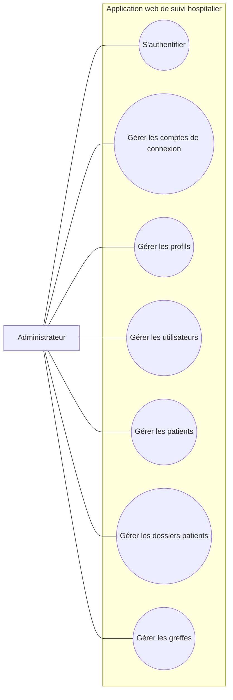
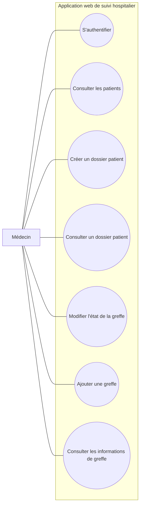
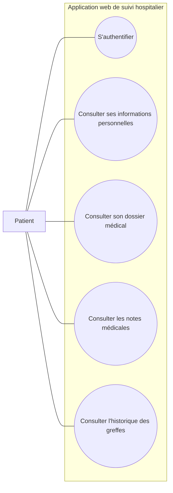

# Diagrammes de cas d'utilisation par utilisateur

Ce document présente un diagramme de cas d'utilisation distinct pour chaque type d'utilisateur de l'application.

## 1. Administrateur

Résumé : l'administrateur accède à l'interface d'administration pour gérer les comptes, les profils, les utilisateurs, les patients, les dossiers et les greffes.

## 2. Médecin

Résumé : le médecin suit les patients, crée et consulte les dossiers, puis met à jour les données liées aux greffes.

## 3. Patient

Résumé : le patient se connecte à son espace sécurisé pour consulter ses informations, son dossier médical, ses notes et l'historique de ses greffes.