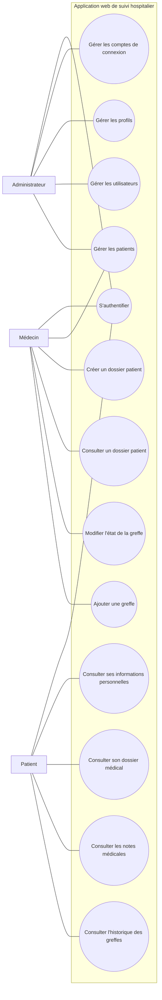

# Diagramme de cas d'utilisation

Ce diagramme représente les principaux acteurs et cas d'utilisation de l'application de gestion hospitalière.

## Version courte à expliquer à l'oral

L'application comporte trois acteurs principaux : l'administrateur, le médecin et le patient. L'administrateur gère les comptes, les profils et les utilisateurs. Le médecin gère les patients, crée les dossiers et met à jour les informations de greffe. Le patient accède à son espace personnel pour consulter son dossier médical, les notes et l'historique des greffes.